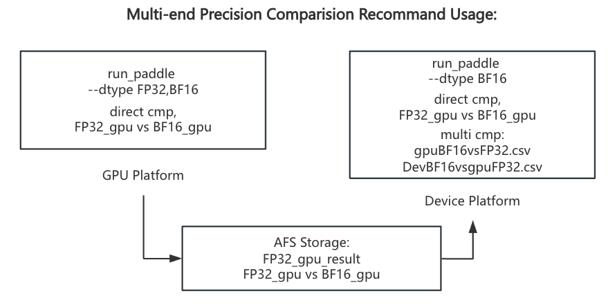
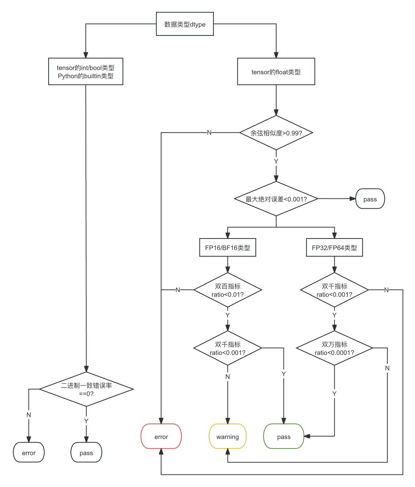

[简体中文🀄](./README_CN.md) | **English🌎**

<p align="center">
  
</p>

<p align="center">
    <a href="./LICENSE"></a>
    <a href=""></a>
    <a href=""></a>
    <a href="https://github.com/PaddlePaddle/PaddleAPEX/graphs/contributors"></a>
    <a href="https://github.com/PaddlePaddle/PaddleAPEX/commits"></a>
</p>

**PaddleAPEX** is an accuracy and performance expansion pack for PaddlePaddle, supporting operator accuracy checking & operator performance profiling and run-time device memory cost analysis. PaddleAPEX is designed to help developers achieve auto accuracy checking and performance profiling for various devices on paddlepaddle.

## Api_tracer
Accuracy auto-checker, which can grasp target operators in training models.
### Before run: Let us check our global config

#### Step1: Set up your config.
Accuracy tool need some configuration before start, you need set target_step, dump_mode.
If you set dump_mode=real_data, you need set dump_root_path.(This path can be a local path or a remote path)

**Advanced usage:**
    You can set Async_data=True to dump real_data asynchronously. Apex will work better when you set a remote path.
For more details, please refer to **PaddleAPEX/paddleapex/api_tracer/configs/tool_config.yaml**.

#### Step2: Set config path.

If you use default config file, you can modify specific variable in this file, such as target_step, dump_root_path.

**Advanced usage:**
    You can also set your own configuration file by setting environment variable via: ```  export APEX_CONFIG_PATH=your_own_path/tool_config.yaml ```
#### Step3: Install into your python environment.

``` Shell
    # If you are using conda, you can install it by:
    cd PaddleAPEX
    pip install -e .

    # If you are using virtualenv, you can add it to your virtualenv by:
    export PYTHONPATH=[abs_path to PaddleAPEX]:$PYTHONPATH
    e.g.:
    export PYTHONPATH=/root/paddlejob/workspace/xjm/0708/PaddleAPEX:$PYTHONPATH

```

#### Step4: Record your target operators.
1. Take **demo.py** as example.
    ``` Python
    import paddle
    from paddleapex import Tracer

    if __name__ == "__main__":
        a = paddle.randn([2,2])
        b = paddle.randn([2,2])

        apex = Tracer()
        apex.start()
        y = paddle.add(a,a)
        y = paddle.add(a,a)
        apex.stop()
2. Take Llama2-13b traning as example:
    For more details, please refer to [Llama2-13b](https://github.com/PaddlePaddle/PaddleNLP/pull/8503)

3. Run your code, and get a json file:
    ```
    After running code above, our tool can dump real_data or tensor satistical data asynchronously.
    Here, we can get dumped json file and tensor(Optional).
    ```
        |-- dump_info
            |-- rank0_step5
            |-- rank0_step20
                |-- forward_rank0.json
                |-- Paddle*add*0.0.pt
                |-- Paddle*add*0.1.pt
                |-- Paddle*add*1.0.pt
                |-- Paddle*add*1.1.pt

4. **Advanced Usage:** If you have specific api which you want to trace(e.g. layer_norm), you can add its api call stack in **paddleapex/api_tracer/configs/op_target.yaml** like:
```yaml
  target op:
  -  paddle.add
  -  paddle.mul
  -  paddle._C_ops.layer_norm
  -  paddlenlp.transformers.fusion_ops.xxx
```
    Please note that paddleapex only support paddle apis which contain regular types, not suppport custom object instance.


#### Step5: Accuracy comparision.
1.  Directly comparision:
    ```Shell
    cd paddleapex/apex
    python run_paddle.py -json [json_path] -backend [gpu/npu/cpu] -out[local_path/remote_path] --dtype FP32,FP16,BF16 -mode all -op <op_name>
    # mode can combine mem, acc, pro arbitary. E.g.:-mode mem,acc or -mode all
    # -op is optional args, if you want to run specific op.
    ```
    This script will generate a repository, which contains api fwd/bwd outputs results. The sturcture is as follows:

        |-- local_path
            |-- backend_output
            |-- backend_output_backward
            |-- Warning_list.txt
    UT Runtime errors and warnings will be recorded in Warning_list.txt.
    After runing this script twice on different backends, you can run comparision tool to get accuracy result:

    ```Shell
    python acc_direct_cmp.py --benchmark [gpu_dump_repo] --device [npu_dump_repo] -o [result_path]
    ```
    This script will generate two csv files, which contains accuracy result and details.

2.  Multi-end precision comparision.
    ```
        # We use run_paddle.py to run the same operator on different devices and generate corresponding outputs.
        python run_paddle.py -json [json_path] -backend [gpu/npu/cpu] -out[local_path/remote_path] --dtype FP32,FP16,BF16 -mode all -op <op_name>
        python run_paddle.py -json [json_path] -backend [gpu/npu/cpu] -out[local_path/remote_path] --dtype FP32,FP16,BF16 -mode all -op <op_name>
        # This script will generate a repository, which contains api fwd/bwd outputs results.
        # Then we need to execute two times directly comparision tool.
        python acc_direct_cmp.py --benchmark [gpufp32_dump_repo] --device [gpubf16_dump_repo] -o [result_path]
        python acc_direct_cmp.py --benchmark [gpufp32_dump_repo] --device [npubf16_dump_repo] -o [result_path]
        python acc_multi_cmp.py --benchmark [gpufp32_gpubf16] --device [gpufp32_npubf16] -o [third_party_cmp_path]
    ```
    We provide a flow chart for Multi-end precision comparision.


    
3.
    For cross framework comparision is in WIP, it will coming soon!

#### Step6: Performance/Memory comparision.
     1. Test cases running:
     ```
        cd paddleapex/apex
        python run_paddle.py -json [json_path] -backend [gpu/npu/cpu] -out[local_path/remote_path] --dtype [dtype] -mode mem,pro
        # exec code above on different devices, and generate corresponding outputs.
    ```
    2. Test cases comparision:
    ```
        cd paddleapex/apex
        python prof_cmp.py --benchmark [gpu_repo] --device [npu_repo] -o [result_path]
    ```


4. Directly comparision standard:
    We provide a logic flow chart for Directly comparision between devices.
    

