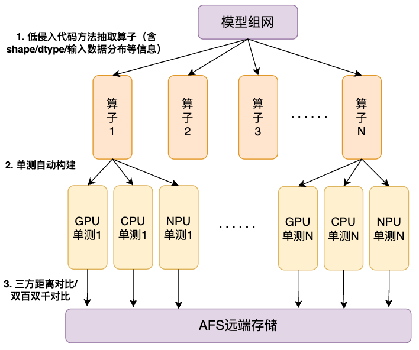

# PaddleAPEX
PaddleAPEX：Paddle Accuracy and Performance EXpansion pack
## Acc_tool:
Accuracy auto-checker, which can grasp target operators in LLM models.

<!-- <center>
    
</center> -->
### Before run: Let us check our global config

#### Step1: Set up your config.
Accuracy tool need some configuration before start, all settings are list in **PaddleAPEX/Acc/configs/tool_config.yaml** 

#### Step2: Set config path.
We provide two ways to set APEX config:

1. 
    If you use default config, remember to change path in Acc/config.py:
    ``` Python
        # We recommand you set APEX_CONFIG_PATH as a real path.
        config_path = os.environ.get('APEX_CONFIG_PATH','./PaddleAPEX/Acc/configs/tool_config.yaml')
    ```
2. 
    You can also set this variable by environment variable via:
    ``` Shell
        # We recommand you set APEX_CONFIG_PATH as a real path.
        # Here is a sample:
        export APEX_CONFIG_PATH=./PaddleAPEX/Acc/configs/tool_config.yaml
    ```
#### Step3: Details to be noticed:
1.  In Acc/Async_save_data.py, it provides an async way to save tensor, we fix the multi-processes number to 3, you can change it according to platform conditions.

    **Warning:** If you donot purchase super performance, **you'd better not** to update this value, it may cause system unstable!


2.  Check your repository structure

        |-- demo.py    # Import Acc_Tool in this file.
        |-- PaddleAPEX # Parellel to demo.py

#### Runing Accuracy Tool:
1. Insert APEX-Acc into code segment(Take **demo.py** as example).
    ``` Python
    import paddle
    from PaddleAPEX import Acc

    if __name__ == "__main__":
        a = paddle.randn([2,2])
        b = paddle.randn([2,2])

        apex = Acc()
        apex.start()
        y = paddle.add(a,a)
        y = paddle.add(a,a)
        apex.stop()
    ```
    After running code above, our tool can dump real_data or tensor satistical data asynchronously. 
    Here, we can get dumped json file and tensor(Optional).
    
        |-- dump_info
            |-- rank0_step5
            |-- rank1_step5
            |-- rank0_step20
            |-- rank1_step20
                |-- forward_rank0.json
                |-- Paddle*add*0.0.pt
                |-- Paddle*add*0.1.pt
                |-- Paddle*add*1.0.pt
                |-- Paddle*add*1.1.pt

2.  We provide ut_test with two modes:
    In comparision step, we provide you with two mode: **multi-backends comparision** and **deirect backends comparision**.
    1. Three backends execute paddle apis:

        ```Shell
        # On GPU server:
        python run_ut.py --forward [json_path] --dump_path [dump_path] --backend gpu --model real/random
        # On NPU server:
        python run_ut.py --forward [json_path] --dump_path [dump_path] --backend npu --model real/random
        ```
        Scripts perform comparision between npu<->cpu, gpu<->cpu, each script will outputs *accuracy_result.csv* and *accuracy_details.csv*.
    
    2.  Directly execute paddle apis on two different backends. 
        ```Shell
        # Directly Comparision between NPU/GPU:
        python Directly_run_ut.py --forward [json_path] --dump_path [dump_path] --backend gpu/npu --model real/random
        ```
        Given fixed seed on CPU, Paddle can generate producible data. Operates will be perform based on these data.


3. Auto compare by multi-precision standards.
    ```Shell
    # Three backends comparision:
    python api_precision_compare.py --detail1 [detail_npu.csv]  --detail2  [detail_gpu.csv]  --output_path  [output_path]
    
    # Directly backends comparision
    # input_dir1 contains real tensors from specific backend.
    python compare.py --input_path1 [input_dir1]  --input_path2  [input_dir2]  --output_path  [output_path]

    ```
