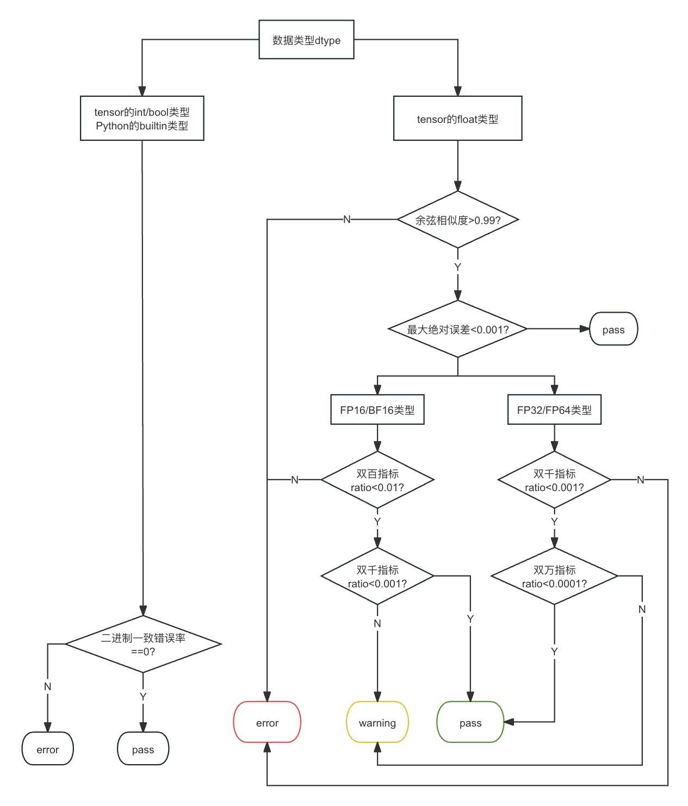

# PaddleAPEX
PaddleAPEX：Paddle Accuracy and Performance EXpansion pack
## Api_tracer
Accuracy auto-checker, which can grasp target operators in training models.

<!-- <center>
    
</center> -->
### Before run: Let us check our global config

#### Step1: Set up your config.
Accuracy tool need some configuration before start, all settings are list in **PaddleAPEX/Acc/configs/tool_config.yaml**

#### Step2: Set config path.
We provide two ways to set APEX config:

1.
    If you use default config file, you can modify specific variable in this file, such as target_step, dump_root_path.
2.
    You can also set your own configuration file by setting environment variable via:
    ``` Shell
        # We recommand you set APEX_CONFIG_PATH as a real path.
        # Here is a sample:
        export APEX_CONFIG_PATH=your_own_path/tool_config.yaml
    ```
#### Step3: Install in to your python environment.

``` Shell
    # Install APEX-Acc in your python environment.
    cd PaddleAPEX
    pip install -e .
```

#### Step4: Record your target operators.
1. Take **demo.py** as example.
    ``` Python
    import paddle
    from paddleapex import Tracer

    if __name__ == "__main__":
        a = paddle.randn([2,2])
        b = paddle.randn([2,2])

        apex = Tracer()
        apex.start()
        y = paddle.add(a,a)
        y = paddle.add(a,a)
        apex.stop()
2. Take Llama2-13b traning as example:
    For more details, please refer to [Llama2-13b](https://github.com/PaddlePaddle/PaddleNLP/pull/8503)

3. Run your code, and get a json file:
    ```
    After running code above, our tool can dump real_data or tensor satistical data asynchronously.
    Here, we can get dumped json file and tensor(Optional).
    ```
        |-- dump_info
            |-- rank0_step5
            |-- rank0_step20
                |-- forward_rank0.json
                |-- Paddle*add*0.0.pt
                |-- Paddle*add*0.1.pt
                |-- Paddle*add*1.0.pt
                |-- Paddle*add*1.1.pt

4. If you have specific api which you want to trace, you can add its api call stack in **paddleapex/api_tracer/configs/op_target.yaml** like:
```yaml
  target op:
  -  paddle.add
  -  paddle.mul
  -  xxxxx
  -  paddle.distributed.fleet.layers.mpu.mp_ops._c_identity
  -  paddle.xxxx.xxx
  -  paddlenlp.transformers.fusion_ops.xxx
```
    Note, paddleapex only support paddle apis which contain regular types, not suppport custom object instance.


#### Step5: Accuracy comparision.
1.  Same framework, different backends comparision:
    ```Shell
    cd backend_cmp
    python run_paddle_multiback.py -json [json_path] -backend [gpu/npu/cpu] -out[local_path/remote_path] -enforce_dtype ["FP32","FP16","BF16"]
    ```
    This script will generate a repository, which contains api fwd/bwd outputs results. The sturcture is as follows:
            |-- local_path
                |-- backend_output
                |-- backend_output_backward
                |-- Warning_list.txt
    UT Runtime errors and warnings will be recorded in Warning_list.txt.
    After runing this script twice on different backends, you can run comparision tool to get accuracy result:

    ```Shell
    python direct_cmp.py -gpu [gpu_dump_repo] -npu [npu_dump_repo] -o [result_path]
    ```
    This script will generate two csv files, which contains accuracy result and details.

2.  Different frameworks, api accuracy comparision:
    ```Shell
    cd framework_cmp
    # Dump json file shoule be converted to paddle/torch format.
    # Modify json_transfer.py, check path to target json.
    python json_transfer.py 
    # You can obtain two json, xx_paddle.json and xx_torch.json
    # Run test case&compare
    # Modify launch_test.py, check configurations.
    python launch_test.py
    # You can get accuracy result&details.

3. Directly comparision standard:
    We provide a logic flow chart for Directly comparision between devices.
    
    <!-- <center>
        
    </center> -->


4. Multi-end precision comparision.
    Multi-end comparision is conducted on two direct comparision csv files.
    ```Shell
    # Three backends comparision:
    python api_precision_compare.py --detail1 [detail_npu.csv]  --detail2  [detail_gpu.csv]  --output_path  [output_path]
    ```
