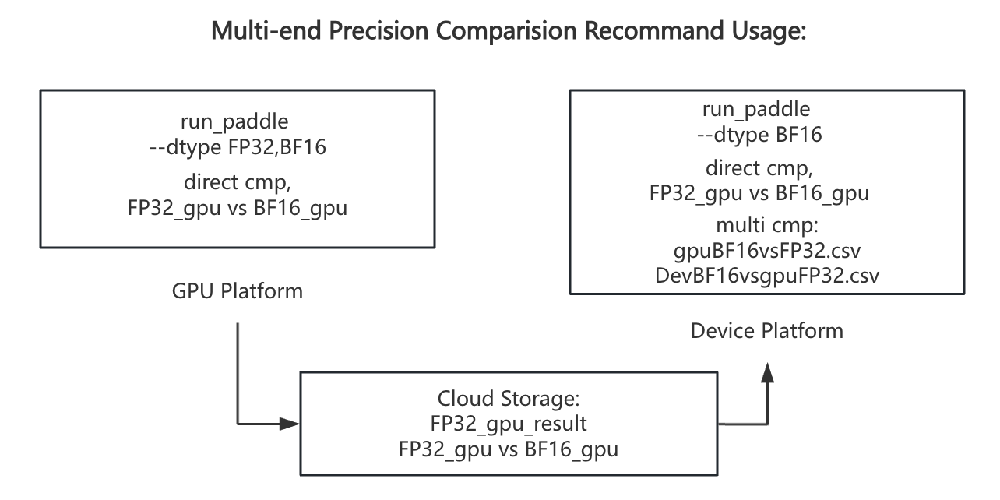

**简体中文🀄** | [English🌎](./README.md)

<p align="center">
  
</p>

<p align="center">
    <a href="./LICENSE"></a>
    <a href=""></a>
    <a href=""></a>
    <a href="https://github.com/PaddlePaddle/PaddleAPEX/graphs/contributors"></a>
    <a href="https://github.com/PaddlePaddle/PaddleAPEX/commits"></a>
</p>

**PaddleAPEX** 是精度和性能扩展包，用于PaddlePaddle，支持算子精度检查、算子性能分析以及运行时设备内存消耗分析。PaddleAPEX旨在帮助开发者实现模型训练的精度检查和性能分析。

## API追踪工具
精度自动检查器，可以抓取训练模型中的目标算子。
### 在开始之前，让我们先检查一下全局配置

#### Step1: 设置你的配置文件。
抓取工具需要一些配置才能启动，你需要设置target_step, dump_mode。
如果你设置dump_mode=real_data，你需要设置dump_root_path。（这个路径可以是本地路径或远程路径）

**进阶用法：**
    你可以设置Async_data=True来异步地传输数据。当使用远端路径时，Apex会加快抓取速度。    
    性能模式可以通过设置Profile_mode=True来开启。在性能模式中，Apex会使用**paddle.max**, **paddle.min**来分析张量。这可能会导致精度损失，但能够获得更高的训练性能。
更多细节问题请参考文件**PaddleAPEX/paddleapex/api_tracer/configs/tool_config.yaml**。

#### Step2: 设置配置文件位置。

如果你使用默认配置文件，你可以在这个文件中修改特定的变量，比如target_step, dump_root_path。

**进阶用法:**
    你也可以设置自己的配置文件，通过设置环境变量来实现： ```  export APEX_CONFIG_PATH=your_own_path/tool_config.yaml ```

#### Step3: 将PaddleAPEX安装到你的python环境中。

``` Shell
    # 为了能在全局访问paddleapex
    export PYTHONPATH=[abs_path to PaddleAPEX]:$PYTHONPATH
```

#### Step4: 记录算子信息。
1. 以**demo.py**为例：
    ``` Python
    import paddle
    from paddleapex import Tracer

    if __name__ == "__main__":
        a = paddle.randn([2,2])
        b = paddle.randn([2,2])

        apex = Tracer()
        apex.start()
        y = paddle.add(a,a)
        y = paddle.add(a,a)
        apex.stop()
    ```
2. 以Llama2-13b模型分布式训练为例：
    对于其中的调用细节，可以参考[Llama2-13b](https://github.com/PaddlePaddle/PaddleNLP/pull/8503)

3. 运行你的训练代码：
    ```
    在运行上述代码之后，我们的工具可以异步地抓取算子信息。
    这里我们得到了json文件和张量文件(可选)。
        |-- dump_info
            |-- rank0_step5
            |-- rank0_step20
                |-- forward_rank0.json
                |-- Paddle*add*0.0.pt
                |-- Paddle*add*0.1.pt
                |-- Paddle*add*1.0.pt
                |-- Paddle*add*1.1.pt
4. **进阶使用:** 如果你有一些特定的api需要抓取（例如LayerNorm，你可以在**PaddleAPEX/paddleapex/api_tracer/configs/op_target.yaml**中添加这些api的调用栈。下方是使用示例：

```yaml
  target op:
  -  paddle.add
  -  paddle.mul
  -  paddle._C_ops.layer_norm
  -  paddlenlp.transformers.fusion_ops.xxx
```
    请注意，paddleapex只支持包含常规类型的paddle api，不支持自定义对象实例。


#### Step5: 精度比较工具
1.  直接比较:
```Shell
cd paddleapex/apex
python run_paddle.py -json [json_path] -backend [gpu/npu/cpu] -out[local_path/remote_path] -dtype FP32,FP16,BF16 -mode all -op <op_name>
# mode参数可以由mem acc pro三者任意组合，以逗号分隔，例如 -mode mem,acc 也可以直接使用-mode all 来唤醒所有测试。
# -op 是可选参数, 这会进入debug模式，仅运行目标算子。
E.g.:
python run_paddle.py -json ./dump_info/rank0_step2/forward_rank0.json -backend gpu -out ./ -dtype FP32 -mode acc
```
这个脚本运行后会产生一个目录，其中包含api fwd/bwd的输出结果。结构如下：

    |-- local_path
        |-- backend_output
        |-- backend_output_backward
        |-- Warning_list.txt
运行中的错误和告警均会记录在Warning_list.txt中。
在不同后端运行两次该脚本后，你可以运行比对工具来获得精度结果：

```Shell
python acc_direct_cmp.py --benchmark [gpu_dump_repo] --device [npu_dump_repo] -o [result_path]
```
这个脚本生成两个csv文件，他们分别包含精度结果和细节。

2. 多端精度比较
```shell
    # 我们使用run_paddle.py 在不同设备商运行相同的算子，并生成相应的输出。
    python run_paddle.py -json [json_path] -backend [gpu/npu/cpu] -out[local_path/remote_path] --dtype FP32,FP16,BF16 -mode all -op <op_name>
    python run_paddle.py -json [json_path] -backend [gpu/npu/cpu] -out[local_path/remote_path] --dtype FP32,FP16,BF16 -mode all -op <op_name>
    # 接下来使用两次直接比较方法，获得比对csv结果。
    python acc_direct_cmp.py --benchmark [gpufp32_dump_repo] --device [gpubf16_dump_repo] -o [result_path]
    python acc_direct_cmp.py --benchmark [gpufp32_dump_repo] --device [npubf16_dump_repo] -o [result_path]
    python acc_multi_cmp.py --benchmark [gpufp32_gpubf16] --device [gpufp32_npubf16] -o [third_party_cmp_path]
```
我们提供了多端比对的推荐流程图，您可以参考：
    <p align="center">
    
    </p>
3. 对于跨框架比对，我们正在开发中，它会很快上线！
#### Step6: 性能、显存分析工具
1. 用例运行
```shell
cd paddleapex/apex
python run_paddle.py -json [json_path] -backend [gpu/npu/cpu] -out[local_path/remote_path] --dtype [dtype] -mode mem,pro
# 在不同后端运行两次该脚本，并生成相应的输出。
```
2. 用例比对
```shell
cd paddleapex/apex
python prof_cmp.py --benchmark [gpu_repo] --device [npu_repo] -o [result_path]
python mem_cmp.py --benchmark [gpu_repo] --device [npu_repo] -o [result_path]
```
3. 生成性能\精度总结报告:
```shell
    cd paddleapex/apex
    python summary_generator.py -acc [acc_result] -prof [prof_detail] -mem [mem_detail]
```

#### 直接比对的标准：
我们提供了一个逻辑流程图，用于直接比较不同设备之间的精度。
<p align="center">

</p>


## 如何运行自动测试
```Shell
    cd PaddleAPEX/paddleapex/test
    bash test.sh <device_platform>
```
